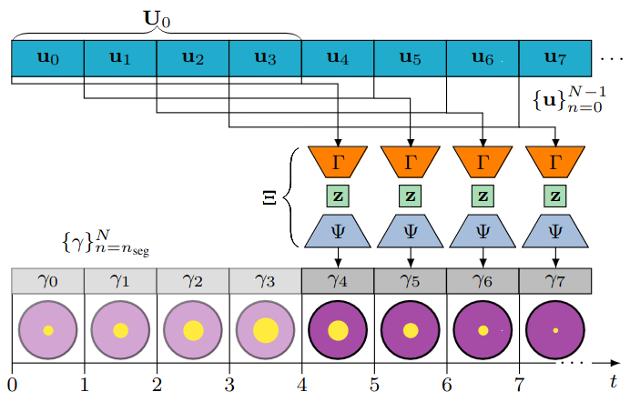
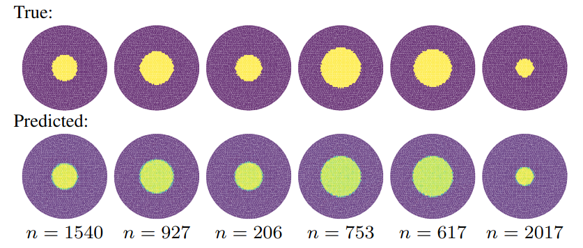

# Prediction of future EIT respiratory cycle images using an LSTM approach

This repository describes the experimental data acquisition of EIT data. For this purpose, a balloon in a phantom tank is ventilated by a medical ventilator. Thirty-two equidistantly distributed electrodes on the tank capture the EIT data using a Sciospec EIT device. A data-driven reconstruction approach, composed of a Variational Autoencoder (VAE) and an LSTM mapper, is used to reconstruct the conductivity distribution in the electrode plane.

**Contents**

- [Data acquisition](notebooks/arduino_only.ipynb)
- [VAE training](notebooks/VAE_training.ipynb)
- [LSTM Mapper training](notebooks/LSTM_Mapper.ipynb)

## Reconstruction network architecture

First, the VAE is used to learn a latent representation of the conductivity distribution in the cross-sectional electrode plane.
Second, a mapper with an LSTM is trained on a sequence of EIT measurements to predict the next EIT image.

  

  <em>Fig. 1: Overview of the temporal data arrangement for predicting a subsequent construction based on previous measurements. The blue boxes represent the EIT measurements, and the corresponding cross-sectional conductivity distribution in the electrode plane is depicted in the bottom boxes.</em>

## Results

  

  <em>Fig. 2: Randomly chosen EIT image predictions from the test data set with the corresponding ground truth

